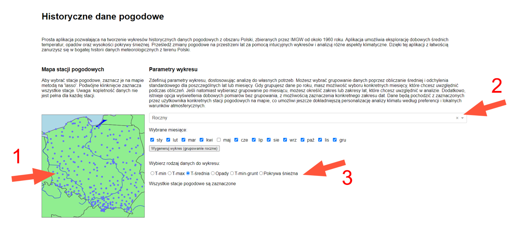
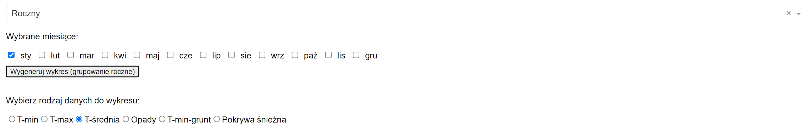
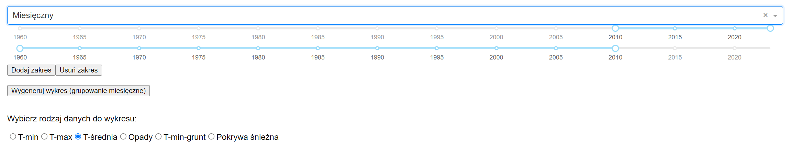
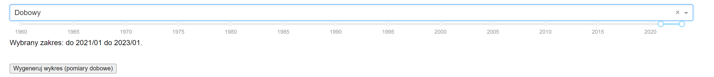
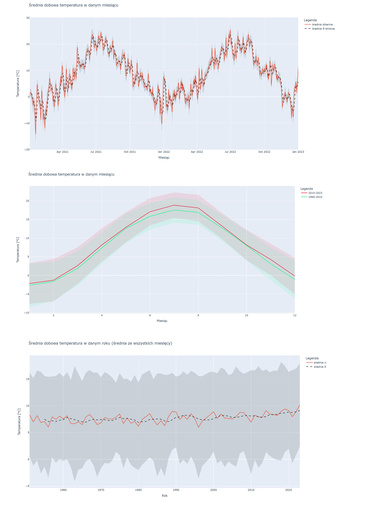

# Historical weather data in Poland
This is a simple web app that enables plotting historical weather data collected over last 70-years by IMGW (https://danepubliczne.imgw.pl/). It allows plotting data such as daily min, mean and max temperature, sum of daily precipitation and maximal snow depth, aggregated over selected periods. The site is currently available in Polish language only.

# Explore the climate in Poland

To explore data, first select source weather stations by using interactive map (marked as 1). Selected stations are written by name on the right. Double click anywhere on the map to return to default state (which is to select all stations). Then, select which type data grouping (marked as 2), available types: yearly, monthly and daily. Each type of grouping is associated with specific settings described below. Then select type of data to be plotted (marked as 3). To plot a chart, use 'Generate chart' button, which will be created below.

The 'yearly' grouping allows to select specific months over which the data will be averaged. Ex. selecting only january and T-min will make a plot of mean daily minimal temperature in january over the years.

The 'monthly' grouping calulcates mean value of data in each month over the selected period. Select the period using range slider. You can also add or remove periods using buttons.

The 'daily' setting allows to plot raw data from a period selected using the range slider.

# Example plots
Here are few interesting plots made using the weather app tool.

# Atrybucja dla Danych IMGW-PIB
Dane meteorologiczne i hydrologiczne pochodzą z Instytutu Meteorologii i Gospodarki Wodnej – Państwowego Instytutu Badawczego (IMGW-PIB).
Właściciel danych: Skarb Państwa
Udostępniający: IMGW-PIB
Podstawy prawne: Ustawa z dnia 11 sierpnia 2021 r. o otwartych danych i Prawo wodne z 20 lipca 2017 r.
Prawo do ponownego wykorzystania: Przysługuje każdemu użytkownikowi zgodnie z regulaminem.
Dostęp do danych: https://danepubliczne.imgw.pl/ i www.meteo.imgw.pl. Dodatkowe dane na wniosek.
Korzystanie z danych: Zgodnie z technicznymi możliwościami IMGW-PIB.
Zakres udostępniania: Obejmuje dane publiczne, wyłączając te stworzone poza zadaniami publicznymi.
Oferta i akceptacja: Regulamin to oferta; akceptacja przez korzystanie z danych.
Dodatkowe dokumenty: Mapy stacji pomiarowych https://hydro.imgw.pl/, wzór wniosku https://danepubliczne.imgw.pl/.